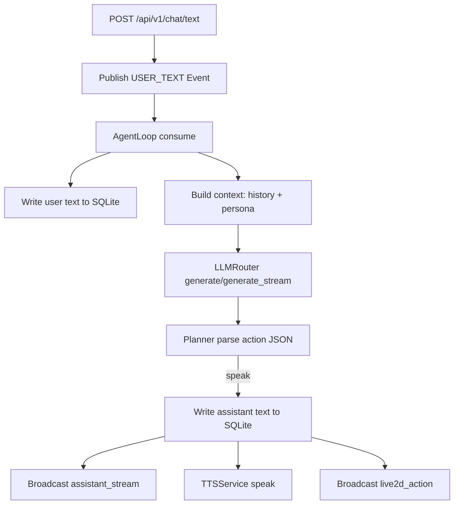
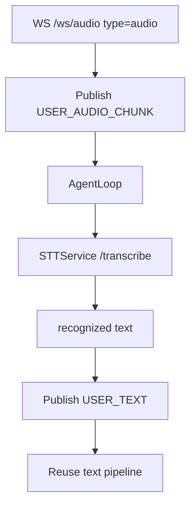

# 运行时调用链详解（零 Python 基础版）

本文解释 Core 在运行时“到底做了什么”，按真实调用顺序展开。

## 1. 系统启动阶段

入口：
- app/main.py

启动流程：
1) FastAPI 创建 app 对象，注册 CORS、HTTP 路由、WS 路由。
2) lifespan 启动钩子触发 app/core/lifecycle.py 的 startup()。
3) startup() 创建依赖：
- EventBus（事件队列）
- SQLiteStore（短期记忆）
- ChromaStore（人格检索）
- MemoryFacade（记忆门面）
- LLMRouter / TTSService / STTService / FrontendGateway
- ToolRegistry（注册工具）
4) 启动后台协程：
- AgentLoop 主循环
- wechat_watcher
- sts_state_watcher
- proactive_scheduler

你可以把它理解为：
- 生命周期函数在“组装发动机”
- AgentLoop 在“持续驱动发动机”

## 2. 文本输入路径（HTTP）

接口：
- 兼容：POST /playground/text
- 标准：POST /api/v1/chat/text

步骤：
1) 路由接收 text。
2) 路由把 text 包装成 EventType.USER_TEXT，发布到 EventBus。
3) AgentLoop 从队列 consume 到 USER_TEXT。
4) AgentLoop 把用户文本写入 SQLite（append_dialogue）。
5) AgentLoop 通过 FrontendGateway 广播 add_history（role=user）。
6) AgentLoop 组装上下文：
- recent_dialogue() 取最近对话
- retrieve_persona_examples() 取人格检索片段
- ContextManager.build_slice() 做 token 预算裁剪
7) LLMRouter 调用 LLM：
- 流式：generate_stream
- 非流式：generate
8) planner.parse_model_action() 解析模型 JSON 动作。
9) 若 action=speak：
- 写入 assistant 对话到 SQLite
- 广播 assistant_stream
- 调用 TTSService.speak
- 广播 add_history（role=assistant）
- 广播 live2d_action（按 emotion 映射）

## 3. 麦克风输入路径（WS）

接口：
- WS /ws/audio

上行包：
- interrupt
- text
- audio(base64 pcm16)

步骤：
1) websocket_audio.py 收到 audio 包。
2) 发布 USER_AUDIO_CHUNK 事件。
3) AgentLoop 收到 USER_AUDIO_CHUNK 后调用 STTService.transcribe_chunk。
4) STT 返回文本后，AgentLoop 再发布 USER_TEXT（回到文本主路径）。

插嘴中断：
1) 前端发送 interrupt 包。
2) 发布 USER_INTERRUPTION。
3) AgentLoop 调 tts.stop_current()，并发 TTS_STOP 事件。

## 4. LLM 调用路径与容错

文件：
- app/services/llm_router.py

逻辑：
1) 根据 LLM_PROVIDER 选择 ollama 或 openai-compatible。
2) 默认 ollama 调 /api/chat。
3) 若 /api/chat 5xx：
- 回退到 /api/generate（非流式兜底）
4) 若流式接口失败：
- 自动降级为非流式一次性返回

好处：
- 避免上游临时 5xx 时“完全不说话”

## 5. TTS 路径

文件：
- app/services/tts_service.py
- bridges/kokoro_onnx_http_bridge.py

核心逻辑：
1) TTSService 读取 TTS_PROVIDER。
2) 若 kokoro：
- 先调 /v1/audio/speech
- 失败则回退 /tts
3) Kokoro bridge 内部：
- 文本清洗
- 分句分块
- 对 index 510 bug 做递归拆分兜底
- 拼接波形后输出 WAV

## 6. 记忆机制（当前实现）

### 6.1 短期记忆（SQLite）

存储：
- 表 dialogue(id, role, text, created_at)

写入时机：
- 用户文本进入主流程时写入
- 助手最终 speak 文本写入

读取时机：
- 每轮推理前取最近 N 条（默认 16）作为对话历史

### 6.2 人格检索记忆（Chroma）

来源：
- 人格语料导入脚本 import_persona_jsonl.py

使用：
- 按当前 query 做语义检索 top_k
- 检索结果作为 Persona style examples 注入 system 侧上下文

### 6.3 当前边界

当前不是“自动长期记忆沉淀”全链路：
- 对话会写 SQLite
- 人格检索来自 Chroma
- 但对话内容并不会自动摘要后写入 Chroma 形成长期语义记忆

## 7. 工具调用路径

文件：
- app/tools/registry.py
- app/tools/*.py

流程：
1) planner 解析出 action=tool_call。
2) AgentLoop 通过 ToolRegistry.call(name, args) 调工具。
3) 工具返回字符串结果。
4) AgentLoop 把工具结果以 TOOL_RESULT 事件再入队，驱动下一轮推理。

注意：
- 目前部分工具是“薄实现/转发实现”（依赖外部桥）。

## 8. 前端消息广播路径

文件：
- app/services/frontend_gateway.py
- app/api/routes_frontend_ws.py

机制：
1) 前端通过 /ws/live2d 连接。
2) FrontendGateway 维护连接集合。
3) AgentLoop 在关键节点广播：
- add_history
- assistant_stream
- live2d_action

## 9. 定时与外部输入

后台协程：
- wechat_watcher: 轮询微信桥，投递 WECHAT_MESSAGE
- sts_state_watcher: 轮询游戏状态，投递 GAME_STATE
- proactive_scheduler: 超时静默后投递 SCHEDULE_TICK

## 10. 异常与降级策略

已实现：
- AgentLoop 捕获单事件异常，不会导致主循环退出。
- LLM 失败时向前端发可见错误文本。
- Kokoro 长文本 bug 兜底拆分。

仍建议加强：
- 外部桥接失败告警提升为 warning 级别
- 对工具失败做结构化错误码而非纯文本

## 11. 一图看懂（文本输入）

## 12. 一图看懂（音频输入）

